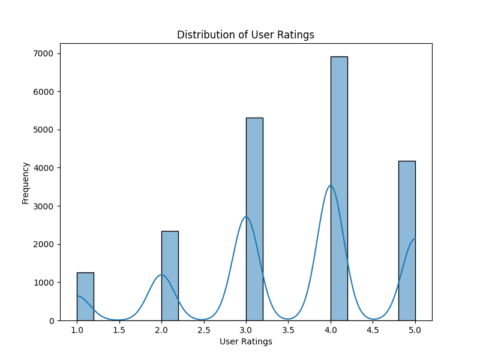
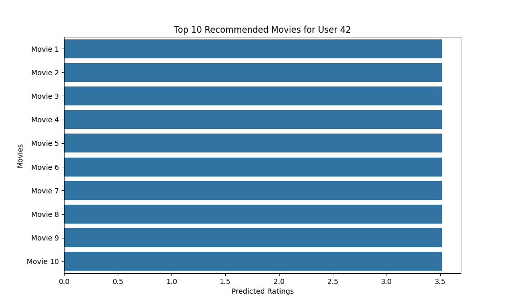

# Movie Recommendation System

This project implements a basic movie recommendation system using the MovieLens 100K dataset and the Surprise library. It provides personalized movie recommendations and includes visualizations of user ratings and top recommended movies.

## Project Structure

- `data/`: Contains the MovieLens 100K dataset.
- `models/`: Contains the recommendation system code.

## Getting Started

1. Install the required dependencies listed in `requirements.txt`.
2. Run the `recommendation_model.py` script to train the recommendation model and make recommendations.

## Visualizations

### User Ratings Distribution

This histogram visualizes the distribution of user ratings in the dataset.

### Top Recommended Movies for User

This bar chart displays the top N recommended movies for a specific user, based on the recommendation model's predictions.

## Usage

- Modify the user ID and the number of top recommended movies in `recommendation_model.py` as needed.
- Run the script to generate movie recommendations and visualizations.

## Requirements

See `requirements.txt` for a list of required dependencies.

## License

This project is licensed under the MIT License.
